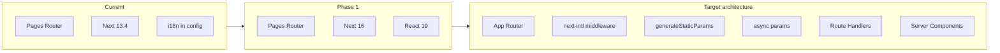

# Next.js 16 migration plan

## Upgrading to Next.js 16 with Next Devtools

The **Next Devtools MCP** provides a dedicated tool to upgrade to Next.js 16:

- **Tool**: `upgrade_nextjs_16` (optional `project_path`, e.g. workspace root)
- **Behavior**: Runs the **official codemod first** (upgrades Next.js, React, React DOM automatically), then provides **manual guidance** for anything the codemod does not fix
- **Covers**: Version upgrade to 16, async API changes (`params`, `searchParams`, `cookies`, `headers`), config migration, Image defaults, parallel routes, deprecated API removals, React 19 compatibility

**Prerequisites (required by the codemod):**

- **Clean git working directory** — commit or stash all changes before running
- **Node.js 20.9+** (Next 16 drops Node 18)
- npm / pnpm / yarn / bun installed

**How to run:** When you are ready to execute the upgrade, ask to run the Next Devtools upgrade (e.g. “run the Next.js 16 upgrade”). The assistant will call `upgrade_nextjs_16` with your project path. You can also run the codemod yourself: `npx @next/codemod@canary upgrade latest`.

**Next.js 16 highlights** (from the Next Devtools migration resources):

- **Turbopack** is the default bundler (no `--turbopack` flag needed; use `--webpack` if you need webpack)
- **Async request APIs**: `params`, `searchParams`, `cookies()`, `headers()`, `draftMode()` are Promises (e.g. `const params = await props.params`)
- **Middleware → proxy**: `middleware.ts` can be renamed to `proxy.ts` (middleware still works but is deprecated)
- **Cache Components**: optional `experimental.cacheComponents` and `"use cache"`; `revalidateTag` now takes a profile where needed; `updateTag` for Server Actions
- **Removed**: AMP, runtime config (`serverRuntimeConfig` / `publicRuntimeConfig`), PPR flags, `unstable_rootParams()`, some `devIndicators` options
- **Config**: ESLint config moved out of `next.config.js` into `.eslintrc.json`; `serverComponentsExternalPackages` at top-level

---

## Target: most recent compatible architecture

After the upgrade, the migration targets the **current recommended architecture**:

- **Next.js 16** (latest stable) with the **App Router** as the primary routing model
- **React 19** (required by Next 16)
- **Server Components** by default; Client Components (`'use client'`) only where needed
- **App Router data patterns**: async `page.js` / `layout.js`, `generateStaticParams`, and **async `params` / `searchParams`** (Promise-based in Next 16)
- **i18n**: **next-intl** with **middleware** (or **proxy**) and **request config** (no `i18n` in `next.config.js`; locale in path segment e.g. `[locale]`)
- **API**: **Route Handlers** (`app/api/.../route.js`) instead of `pages/api`
- **Metadata**: **generateMetadata** and built-in **sitemap** where applicable
- **Fonts**: existing `next/font` usage in root layout

Reaching this target means **fully migrating off the Pages Router** and removing legacy `_app.js` / `_document.js` and `getStaticProps` / `getStaticPaths`.

---

## Vercel MCP note

The **Vercel MCP** in this project only exposes an authentication tool (`mcp_auth`). There are no Vercel-specific Next.js migration tools available. This plan is based on the official [Next.js 15 upgrade guide](https://nextjs.org/docs/app/guides/upgrading/version-15), [App Router migration guide](https://nextjs.org/docs/app/guides/migrating/app-router-migration), and [next-intl App Router docs](https://next-intl.dev/docs/getting-started/app-router). After migration, you can deploy to Vercel as usual; the MCP does not change the migration steps.

---

## Current state

| Area        | Current                                                                                        |
| ----------- | ---------------------------------------------------------------------------------------------- |
| **Next.js** | 13.4.6                                                                                         |
| **Router**  | Pages Router (`src/pages/`)                                                                    |
| **i18n**    | Built-in `next.config.js` `i18n` (locales: `en`, `pt`) + **next-intl** for messages            |
| **Data**    | `getStaticProps` / `getStaticPaths` on all pages (SSG)                                         |
| **Styling** | SCSS modules, `globals.scss`, styled-jsx in `[_app.js](src/pages/_app.js)`                     |
| **Fonts**   | `next/font/google` (Barlow_Condensed, DM_Sans) in `[src/styles/fonts.js](src/styles/fonts.js)` |
| **API**     | Single route `[src/pages/api/hello.js](src/pages/api/hello.js)`                                |
| **Other**   | next-sitemap (postbuild), next-seo, Notion CMS for blog                                        |

No usage of `cookies()`, `headers()`, or `draftMode()` in the codebase, so async request API changes in Next 16 do not affect existing Pages until you add App Router routes.

---

## Migration approach: two phases

Phase 1 uses **Next Devtools** to upgrade to Next.js 16 and React 19. Phase 2 is the **required** move to the App Router so the repo matches the most recent compatible architecture.

### Phase 1 – Upgrade to Next.js 16 (Next Devtools)

Goal: get onto Next.js 16 and React 19 using the **Next Devtools MCP** to run the codemod and handle follow-up.

1. **Prerequisites**

- **Node.js 20.9+** (Next 16 minimum). Check with `node -v`.
- **Clean git state**: commit or stash all changes (codemod requires it).

1. **Run the Next Devtools upgrade**

- Invoke the **Next Devtools** tool: `upgrade_nextjs_16` with `project_path` set to the repo root (e.g. `/Users/andrerodrigues/git/cdeff`). The tool runs the official codemod first, then guides you through remaining manual fixes.
- Or run the codemod yourself: `npx @next/codemod@canary upgrade latest` (from repo root).

1. **Resolve dependency and config issues**

- Fix any peer dependency warnings (e.g. React 19); use `--legacy-peer-deps` only if needed.
- Upgrade `@types/react` and `@types/react-dom` if using TypeScript.
- If the codemod or Next 16 docs suggest it, move ESLint config out of `next.config.js` into `.eslintrc.json`.

1. **Next.js 16 specifics for this repo**

- **Caching**: Unchanged for `getStaticProps`-based data; if you add `fetch` later, note it’s not cached by default.
- **Fonts**: You already use `next/font`; no change.
- **No** `cookies()`, `headers()`, or `draftMode()` in the codebase, so async request API changes apply only when you add App Router routes.
- **Turbopack**: Default for `next dev` / `next build`; use `--webpack` in scripts if you need webpack.

1. **Keep existing i18n for Phase 1**

- `i18n` in `[next.config.js](next.config.js)` and next-intl in `[_app.js](src/pages/_app.js)` stay as-is until Phase 2.

1. **Smoke test**

- `npm run build` and `npm run dev`; verify all main routes and locale switching. Commit as e.g. “chore: upgrade to Next.js 16 and React 19 (Next Devtools, Pages)”.

---

### Phase 2 – Migrate to App Router and target architecture (required)

Goal: reach the most recent compatible architecture (Next 16 + App Router) by moving to the App Router, next-intl middleware/proxy-based i18n, Route Handlers, and App Router data patterns (async `params` / `searchParams`).

1. **Add App Router structure**

- Create `src/app/` (or `app/` at repo root).
- Add root layout: `app/layout.js` (or `.tsx`) with `<html>`, `<body>`, global styles, and font CSS variables (replace styled-jsx from `_app.js`).

1. **Switch i18n to next-intl + middleware (or proxy)**

- **Remove** `i18n` from `next.config.js` (App Router does not use it).
- Add **next-intl** App Router setup:
- **Middleware** (`src/middleware.js` or `src/proxy.ts` in Next 16): `createMiddleware(routing)` from `next-intl` with `defineRouting({ locales: ['en','pt'], defaultLocale: 'pt' })` and a matcher that excludes `api`, `_next`, static files.
- **Request config** (`src/i18n/request.js` or similar): `getRequestConfig` from `next-intl/server` loading `messages/${locale}.json` and returning `{ locale, messages }`.
- In `next.config.js`, set `plugins: [createNextIntlPlugin()]` (from `next-intl/plugin`) with the path to the request config.
- Replace `next/router` locale/link usage with next-intl’s `useRouter` / `Link` from `createNavigation(routing)` where locale-aware (e.g. `[LanguageSelector](src/components/LanguageSelector/LanguageSelector.jsx)`, `[Navbar](src/components/Navbar/Navbar.jsx)`).

1. **Route migration (incremental)**

- App Router **coexists** with `pages/` during migration; migrate one route at a time.
- For each page:
  - Add `app/[locale]/...` with `layout.js` and `page.js`.
  - Replace `getStaticProps` with async `page.js` that loads the same data (e.g. from `getPosts`, `getPost` in `[src/lib/notion.js](src/lib/notion.js))` and passes to components.
  - Replace `getStaticPaths` with **generateStaticParams** (return `[{ locale, slug: 'x' }, ...]` as needed; Next 15 allows async).
- **Dynamic routes**: e.g. `app/[locale]/blog/[slug]/page.js` with `generateStaticParams` and async `page({ params })`; in Next 16 **params is a Promise**, so `const { slug } = await params` (and `await params` in layout if needed).
- **404**: Add `app/[locale]/not-found.js` and optionally root `not-found.js`.
- **API**: Move `pages/api/hello.js` to **Route Handler** `app/api/hello/route.js`.

1. **Layout and providers**

- Root layout: wrap with `NextIntlClientProvider` (messages from request config). Move `<Layout>` (navbar, footer) into a shared layout under `[locale]` or root layout.
- Fonts: keep `next/font` in root layout and expose CSS variables there (no styled-jsx).

1. **Components**

- Use **Server Components** by default. Add `'use client'` only where needed (`useTranslations`, `useRouter`, browser APIs).
- Replace locale-dependent `next/link` and `next/router` with next-intl’s `Link` and `useRouter` so paths stay locale-prefixed.

1. **Sitemap and SEO**

- Prefer App Router **sitemap.js** (and **metadata** / **generateMetadata**) where possible; keep or adjust next-sitemap if needed for the new route shape.

1. **Decommission Pages**

- Once all routes live under `app/`, remove the corresponding `pages/` files and remove `i18n` from `next.config.js`.

---

## File-level summary

| Item                                                           | Phase 1 (stepping stone)                        | Phase 2 (target architecture)                                |
| -------------------------------------------------------------- | ----------------------------------------------- | ------------------------------------------------------------ |
| [package.json](package.json)                                   | Bump next, react, react-dom, eslint-config-next | Same; ensure next-intl supports App Router                   |
| [next.config.js](next.config.js)                               | No change                                       | Remove `i18n`; add next-intl plugin                          |
| [src/pages/app.js](src/pages/_app.js)                          | No change                                       | Replaced by app layout + NextIntlClientProvider              |
| [src/pages/document.js](src/pages/_document.js)                | No change                                       | Replaced by root layout `<html>` / `<body>`                  |
| [src/styles/fonts.js](src/styles/fonts.js)                     | No change                                       | Used in root layout                                          |
| [src/helpers/locale.helpers.js](src/helpers/locale.helpers.js) | No change                                       | Replaced by next-intl request config                         |
| All pages with getStaticProps/getStaticPaths                   | No change                                       | Reimplement as app route + generateStaticParams + async page |
| [src/lib/notion.js](src/lib/notion.js)                         | No change                                       | Call from Server Components or async page/layout             |
| next-sitemap                                                   | No change                                       | Prefer App Router sitemap.js or adjust to app routes         |

---

## Suggested order of work

1. **Phase 1 – Next.js 16 (Next Devtools)**

- Ensure Node 20.9+ and clean git; then run **Next Devtools** `upgrade_nextjs_16` (or `npx @next/codemod@canary upgrade latest`).
- Fix peer dependency or lint issues; follow any manual steps the tool suggests.
- Run build and manual tests (all main routes and locales).
- Commit as “chore: upgrade to Next.js 16 and React 19 (Pages)”.

1. **Phase 2 – Target architecture**

- Add middleware and next-intl App Router config; keep `pages/` working during migration.
- Create root layout and `[locale]` layout with providers and fonts.
- Migrate one simple static page (e.g. FAQ or About), then dynamic (blog, tournaments), then the rest.
- Move API route to Route Handler; add not-found; adopt generateMetadata and sitemap where applicable.
- Remove migrated `pages/` files and `i18n` from `next.config.js` when done.

---

## Mermaid: migration to target architecture

The outcome of the migration is the **target architecture** (App Router, React 19, next-intl middleware, Route Handlers, generateStaticParams, async params, Server Components by default). Use the Vercel MCP for auth if needed for deployment; the steps above implement the migration to the latest compatible Next.js and React architecture.
